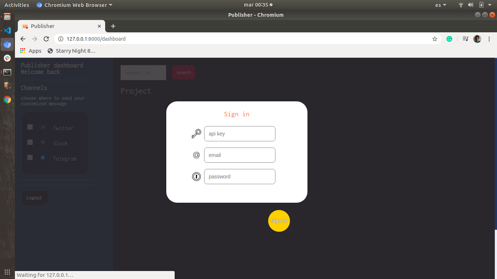
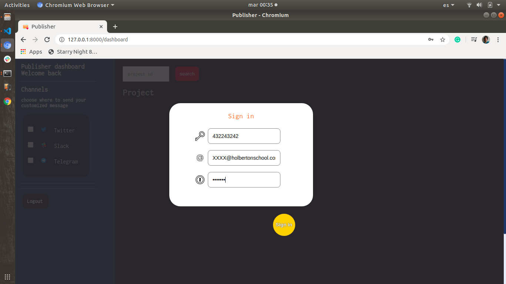
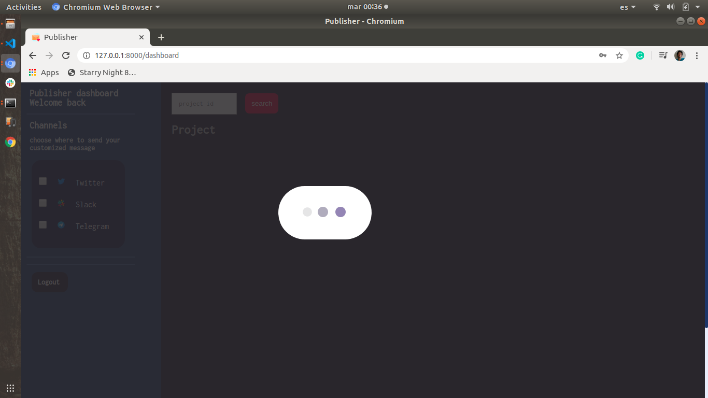
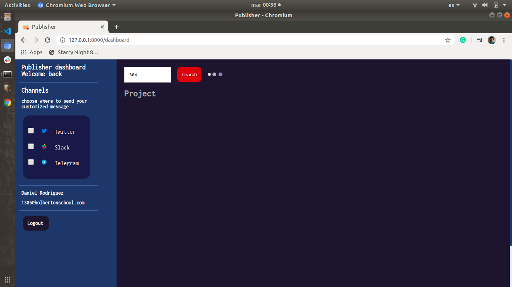
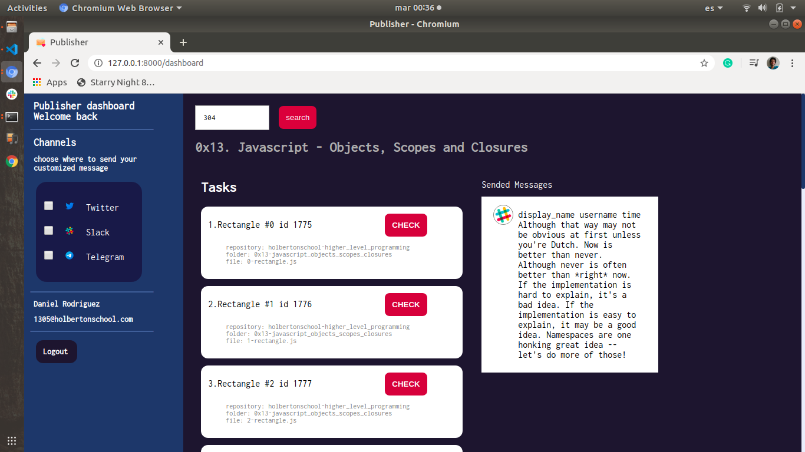
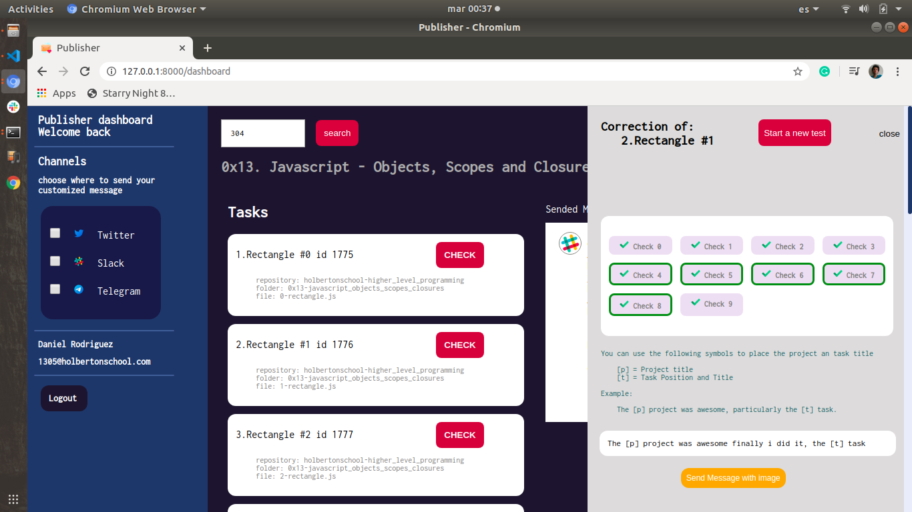
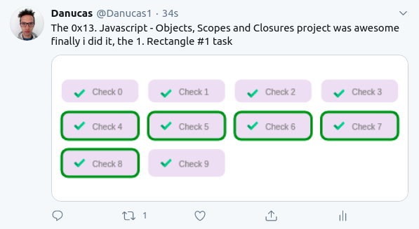

## Finally Did it

A simple tool for checking your Project Tasks, and post the checker result to your Twitter account with a customizable message.

## Requirements
- Holberton API key
- Holberton email
- Intranet Password
- Twitter access credentials

### Environment
- Ubuntu 18.04.4
- Python required 3.6 or higher
- Django 3.0 +

### Install Django and required modules
The installation script covers the mayority of dependency installations, if the environment fail please let me know via email <danrodcastillo1994@gmail.com> by now, I will take care of your need and try to solve the issue.

Install all dependencies and modules

```
./install.sh
```

go to the [checker_publisher](checker_publisher/) directory and run 

```
./refresh_publisher  # This will run migrations functions and will
                       prompt you to create an admin user

# And then
./run_publisher # This will run the server at <localhost:8000/dashboard>
```

### Route

#### /dashboard

This is the main route, via queries will interact with the django ORM engine to provide data reliablity, session management, and social media communication.

you will provide your Holberton API key, your holberton email and intranet password, this data will be stored locally in your machine and will help the api services to make the requests needed. When done with Authentication you will be able to search a project by its id, choose in a list of tasks and run a test for that dutty, then when you are success with the task, you can choose send a customized message via Twitter, to be able to do that you will be promt to save your Twitter app credentials, when submited the checker image will be sent with you message and you will receive the link to the published history

### ScreenShots








